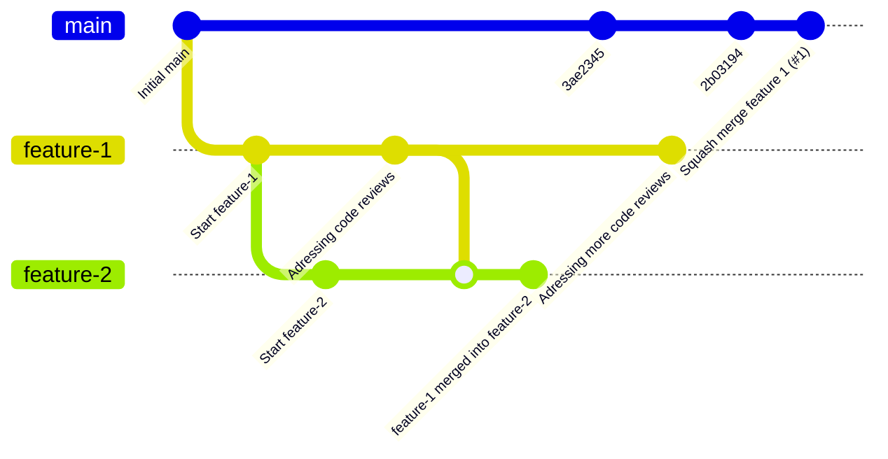
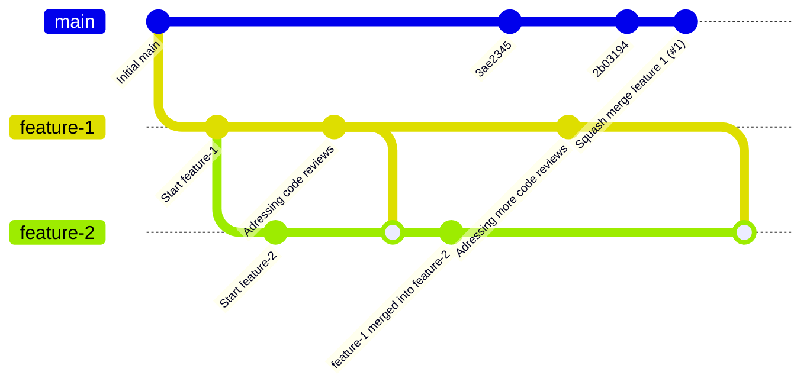
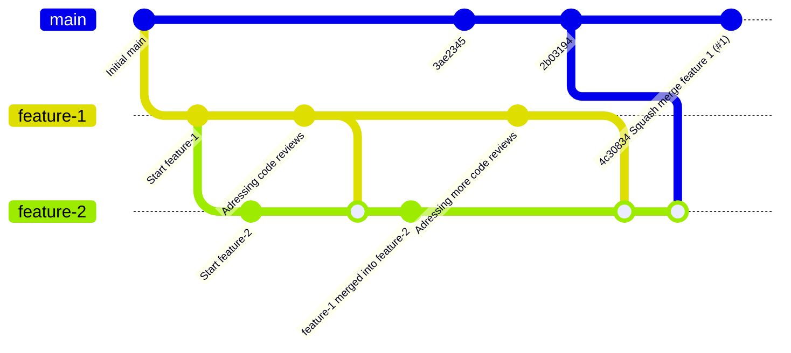

GitHub is a powerful platform for open source collaboration, built on Git’s robust version control system.
One of Git’s standout features is its branching model, which allows for flexible workflows.
However, managing pull requests (PRs) effectively is key to maintaining a clean commit history.
Squashing commits into a single one before merging can streamline this, but it also raises challenges, especially when building new branches on top of a squashed history.
In this post, we’ll explore how to guide Git through these situations and ensure a smooth merge process, even when the initial merge attempt fails.

## Scenario

We are in a [fork and pull model](https://docs.github.com/en/pull-requests/collaborating-with-pull-requests/getting-started/about-collaborative-development-models), where `origin` is the repository of the fork (where we have push rights) and `upstream`, which is the repository we want to contribute to.

- Contributor creates branch `feature-1` with pull request `#1`.
- Contributor builds on `feature-1` branch to create branch `feature-2`.
- Pull request `#1` (and thus `feature-1` branch is updated due to review comments). Contributor can merge `feature-1` into `feature-2` to get the updates in his branch.
- The commit before the merge is `2b03194`
- Finally, pull request `#1` [squash-merged](https://docs.github.com/en/pull-requests/collaborating-with-pull-requests/incorporating-changes-from-a-pull-request/about-pull-request-merges#squash-and-merge-your-commits). That means, a new commit is created with no git-internal reference to the pull request.
- Contributor wants to merge `main` into  `feature-2` to use latest updates of `main`.



## Have `git merge upstream/main` working

First, `feature-2` has to include all changes of `feature-1`:

```terminal
git merge feature-1
```



Second, all changes of `upsteram/main` without the squash merge need to go into `feature-2`:

```terminal
git fetch upstream
git merge 2b03194
```

> You need to execute `git fetch upstream` to ensure that all commits of `upstream` are available locally
{: .prompt-tip }



Third, we need to tell Git the right history:

The content of the current working directory is now the result of the merge of `3ae2345`, `feature-1`, and `feature-2`.
Since `feature-1` was merged into `main` directly after, the commit `4c30834` does not add anything new to the file system.
However, Git does not know.
We need to tell it.

We begin with finding out the tree id, representing the working directory contents:

```bash
$ git cat-file -p feature-2
tree 0d30a034902d9b520cd4bf67ca49262614e83211
parent 60f2f82569318b4d022a454d01d4dab723ee7642
...
```

We use this tree id (`0d30a034902d9b520cd4bf67ca49262614e83211`) in this example to create a new commit:

```bash
$ git commit-tree 0d30a034902d9b520cd4bf67ca49262614e83211 -p feature-1 -p 4c30834
bd31372a645cb0f612119c59981439fb93abd752
```

Git created a new commit `bd31372a645cb0f612119c59981439fb93abd752` having two parents.

This commit now needs to be integrated into `feature-2`.
The following commands ensure that no data is lost in case one did something wrong:

1. `git push origin bd31372a645cb0f612119c59981439fb93abd752:feature-2` to update branch `feature-2` on GitHub.
2. `git pull` to update the local `feature-2` branch with GitHub's view (updated in the previous step).

Now, `git merge upstream/main` should work without any issues.
